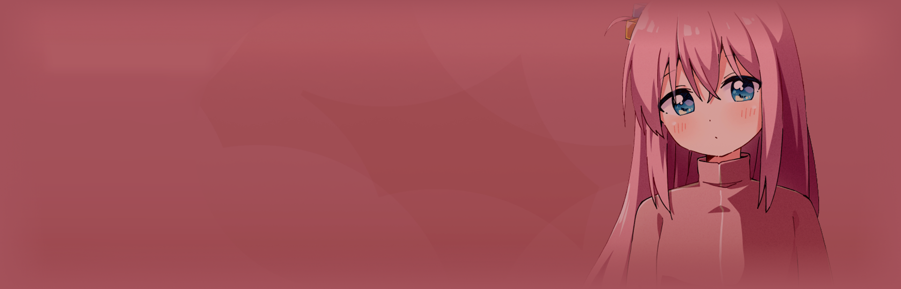

     

# CMGT FED – Final Assignment

This project is my final assignment for Front-End Development. For this website, I wanted to experiment with a different type of design approach and chose to base it on anime. The theme I selected is Bocchi the Rock!, a series that follows Hitori Gotoh — a shy high school girl who struggles with social anxiety. Despite her fears, she joins the all-girl band Kessoku Band and gradually learns how to open up, connect with others, and express herself through music.

The idea behind this project was to capture the colorful, playful, and emotional atmosphere of the anime while showcasing my front-end development skills. I built a merchandise-style website where fans can explore Bocchi the Rock! products such as posters, T-shirts, and accessories. The design emphasizes accessibility, responsive layouts, and small interactive details like hover transitions, making the site feel both fun and user-friendly.

## Key goals of this assignment were:
- Experimenting with a unique theme outside of traditional webshops.
- Creating a fully responsive and accessible design that works on both desktop and mobile.
- Applying all the requirements from the course, such as semantic HTML, forms, Flexbox, and transitions.
- Exploring how anime-inspired visuals can be translated into a practical e-commerce design.

**In the end, this project is both a technical exercise and a creative experiment, combining my interest in anime with front-end development.**